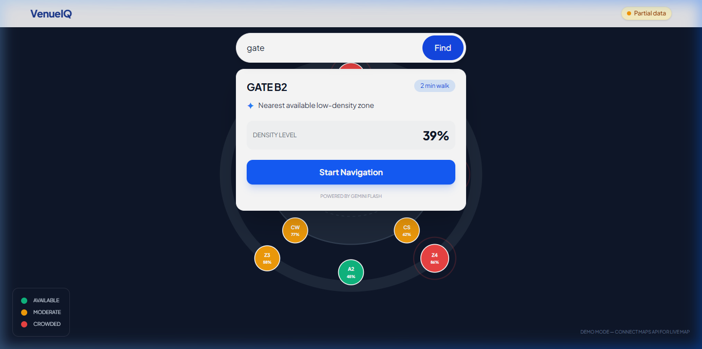
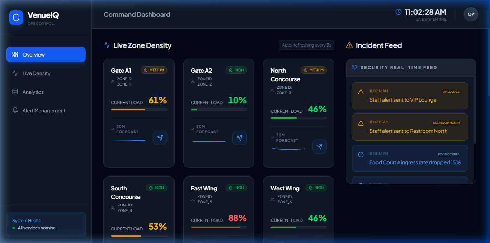
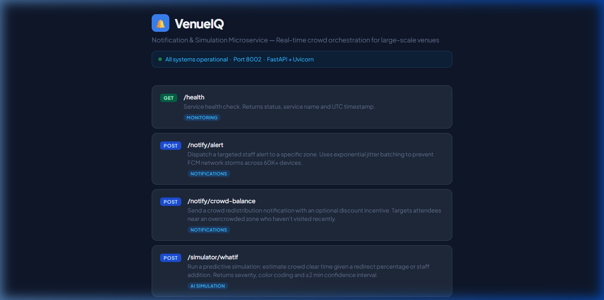

# VenueIQ: AI-Powered Crowd Orchestration Platform

VenueIQ is an advanced crowd management system designed to optimize attendee flow and operational efficiency in large-scale environments like stadiums and convention centers. By integrating real-time telemetry from Wi-Fi and POS systems with predictive ST-GAT models, the platform anticipates bottlenecks before they occur. It leverages Gemini 2.0 Flash to provide intelligent, density-aware navigation for attendees while giving operators powerful simulation tools to orchestrate venue movements.

## 📸 System Overview

| Attendee App (PWA) | Operator Control Room | Notification & Simulation API |
| :---: | :---: | :---: |
|  |  |  |

## 🛠 Google Services Integration

*   **Gemini 2.0 Flash (Google AI Studio)**: Powers the intelligent routing engine in the attendee app, providing natural language navigation advice based on live crowd density.
*   **Google Maps Platform**: Used for high-fidelity venue visualization, heatmap rendering, and precise attendee wayfinding.
*   **Firebase Realtime Database**: Acts as the central state synchronization layer, ensuring sub-second updates for zone density across thousands of devices.
*   **Firebase Cloud Messaging (FCM)**: Dispatches targeted push notifications for crowd balancing with exponential jitter batching to prevent network congestion.
*   **Google Cloud Pub/Sub**: Handles the high-throughput ingestion of Wi-Fi telemetry and POS transaction streams for real-time analysis.

## 🏗 System Architecture

```text
      +-------------------+       +-------------------+
      |   Attendee PWA    | <---  |  Ops Dashboard    |
      +---------+---------+       +---------+---------+
                |                           |
                | (Real-time Sync)          | (Predictive Views)
                v                           v
      +-----------------------------------------------+
      |           Firebase Realtime Database          |
      +-----------------------+-----------------------+
                              ^
                              | (Update Density)
      +-----------------------+-----------------------+
      |        ML Prediction Engine (ST-GAT)          |
      +-----------------------+-----------------------+
                              ^
                              | (Telemetry Stream)
      +-----------------------+-----------------------+
      |       Data Ingestion Service (FastAPI)        |
      +-----------------------+-----------------------+
                              ^
                              | (Message Bus)
      +-----------------------+-----------------------+
      |         Notification & Simulation AI          |
      +-----------------------------------------------+
```

## 🚀 Getting Started

To spin up the entire VenueIQ backend ecosystem (Ingestion, Prediction, and Notification services):

```bash
cd venueiq
docker-compose up --build
```

The services will be available at:
*   **Ingestion**: `http://localhost:8001`
*   **Prediction**: `http://localhost:8002`
*   **Notification**: `http://localhost:8003`

*Note: For local development and HMR, you can also run the frontend applications using `npm run dev` in their respective directories.*
